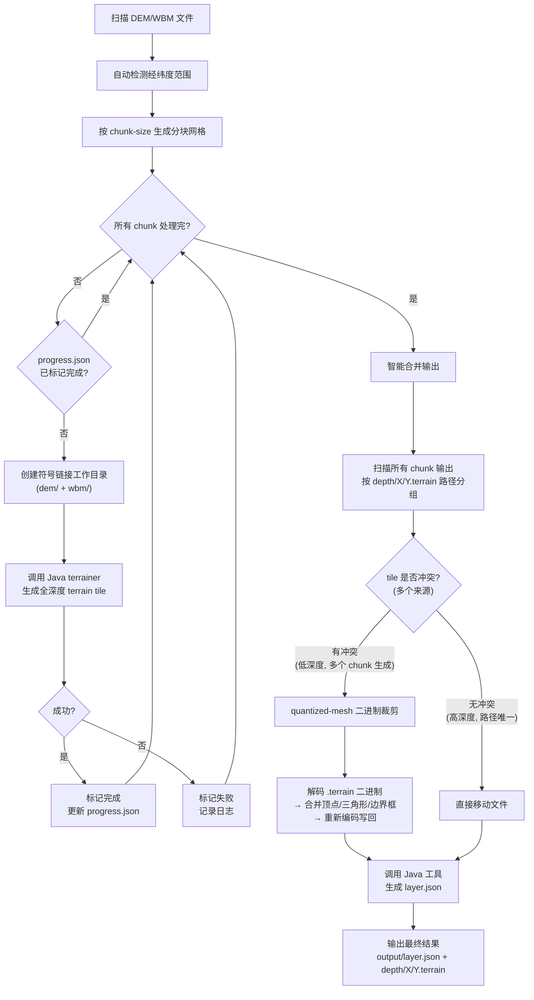

# terrain_chunker.py

分块处理大量 GeoTIFF 地形数据，逐块调用 mago-3d-terrainer，避免 OOM。

## 原理

将经纬度范围按 N° × N° 切分成多个子区域，每块只通过符号链接引用对应的 DEM/WBM 文件，独立调用 Java 工具处理，最后合并所有 terrain tile 并重新生成 `layer.json`。

合并策略：

- **无冲突 tile**（高深度，路径唯一）：直接移动
- **冲突 tile**（低深度，多个分块生成相同路径）：解析 quantized-mesh 二进制格式，合并顶点和三角形数据，重新编码写回

## 生成流程



### 流程说明

整个脚本分为 3 个阶段：准备 → 分块处理 → 智能合并

#### 阶段一：准备

1. 扫描 `--dem-dir` 和 `--wbm-dir`，用正则从文件名提取 (lat, lon) 坐标
2. 自动检测覆盖范围（或用 `--lat`/`--lon` 指定）
3. 按 `--chunk-size`° 将范围切分成 N×N 的网格，跳过空块
4. 加载 `progress.json` 支持断点续跑

#### 阶段二：逐块处理

- 每个 chunk 创建符号链接目录（只链接属于该块的 DEM/WBM 文件）
- 调用 Java terrainer **生成全深度 tile**（不做深度过滤）
- 记录进度到 `progress.json`，支持 Ctrl+C 优雅中断

#### 阶段三：智能合并

- 扫描所有 chunk 输出，按 `depth/X/Y.terrain` 路径分组
- **无冲突**（路径唯一，只有 1 个来源）→ 直接移动
- **有冲突**（同一路径有多个 chunk 生成的文件）→ 解析 quantized-mesh 二进制，合并顶点/三角形/边界框，重新编码写回
- 最后调用 Java 工具生成 `layer.json`

## 环境准备

```bash
cd scripts
uv sync        # 创建虚拟环境
```

## 参数说明

| 参数 | 必需 | 默认值 | 说明 |
| --- | --- | --- | --- |
| `--dem-dir` | 是 | - | DEM 文件目录 |
| `--wbm-dir` | 是 | - | WBM 文件目录 |
| `--output-dir` | 是 | - | 最终合并输出目录 |
| `--jar` | 是 | - | Java JAR 文件路径 |
| `--lat` | 否 | 自动检测 | 纬度范围，格式 `start-end`，如 `3-54` |
| `--lon` | 否 | 自动检测 | 经度范围，格式 `start-end`，如 `73-136` |
| `--chunk-size` | 否 | `10` | 每块度数（1° = 每个 Copernicus 文件单独跑） |
| `--chunk` | 否 | 全部 | 指定分块索引，支持 `3` 或 `3-7` |
| `--heap` | 否 | `16g` | JVM 堆内存大小 |
| `--work-dir` | 否 | `./chunk_work` | 临时工作目录（存放符号链接、分块输出、进度文件） |
| `--java-opts` | 否 | 无 | 传递给 Java 工具的额外参数，如 `-max 14 -th 4` |
| `--dry-run` | 否 | - | 预览分块计划，不实际执行 |
| `--clean` | 否 | - | 清除工作目录，从头开始 |
| `--skip-merge` | 否 | - | 跳过合并步骤，仅处理分块 |

## 使用示例

### 预览分块计划

```bash
uv run python scripts/terrain_chunker.py \
    --dem-dir input/dem \
    --wbm-dir input/wbm \
    --output-dir output/ \
    --jar mago-terrainer/dist/mago-3d-terrainer-1.12.0-release.jar \
    --dry-run
```

### 处理指定经纬度范围（单块）

```bash
uv run python scripts/terrain_chunker.py \
    --dem-dir input/dem \
    --wbm-dir input/wbm \
    --output-dir output/ \
    --jar mago-terrainer/dist/mago-3d-terrainer-1.12.0-release.jar \
    --lat 3-4 --lon 73-74
```

### 处理全量数据（10° 分块）

```bash
uv run python scripts/terrain_chunker.py \
    --dem-dir input/dem \
    --wbm-dir input/wbm \
    --output-dir output/ \
    --jar mago-terrainer/dist/mago-3d-terrainer-1.12.0-release.jar
```

### 只跑特定分块

```bash
# 跑第 3 块
uv run python scripts/terrain_chunker.py ... --chunk 3

# 跑第 3 到 7 块
uv run python scripts/terrain_chunker.py ... --chunk 3-7
```

### 自定义 JVM 堆内存和分块粒度

```bash
# 内存较小：用 5° 分块（每块约 25 个文件）+ 8G 堆
uv run python scripts/terrain_chunker.py \
    --dem-dir input/dem \
    --wbm-dir input/wbm \
    --output-dir output/ \
    --jar mago-terrainer/dist/mago-3d-terrainer-1.12.0-release.jar \
    --chunk-size 5 --heap 8g
```

### 传递额外参数给 Java 工具

```bash
uv run python scripts/terrain_chunker.py \
    --dem-dir input/dem \
    --wbm-dir input/wbm \
    --output-dir output/ \
    --jar mago-terrainer/dist/mago-3d-terrainer-1.12.0-release.jar \
    --java-opts "-max 14 -th 4"
```

## 断点续跑

脚本在 `{work-dir}/progress.json` 中记录每个分块的进度。如果中途中断（Ctrl+C 或错误），重新运行相同命令即可跳过已完成的分块。

```bash
# 第一次运行（中途中断）
uv run python scripts/terrain_chunker.py ...

# 重新运行，自动跳过已完成的分块
uv run python scripts/terrain_chunker.py ...
```

如需从头开始：

```bash
uv run python scripts/terrain_chunker.py ... --clean
```

## 输出结构

```text
chunk_work/                        ← --work-dir
  progress.json                    ← 进度文件
  chunk_00_lat29-32_lon118-122/
    dem/                           ← DEM 符号链接
    wbm/                           ← WBM 符号链接
    output/                        ← 该块的 Java 输出
    output.log                     ← 该块的运行日志
  chunk_01_.../
    ...

output/                            ← --output-dir（最终合并输出）
  layer.json                       ← 合并后重新生成
  0/0/0.terrain
  1/...
  ...
```

## 分块大小选择

| chunk-size | 每块文件数 | 适用场景 |
| --- | --- | --- |
| 1 | 1 | 内存极小（4G 以下） |
| 5 | ~25 | 内存有限（8G） |
| 10 | ~100 | 推荐（16G） |
| 20 | ~400 | 内存充足（32G+） |

## 支持的文件格式

- DEM: `Copernicus_DSM_10_N{lat}_00_E{lon}_00_DEM.tif` 或 `Copernicus_DSM_COG_10_N{lat}_00_E{lon}_00_DEM.tif`
- WBM: `Copernicus_DSM_COG_10_N{lat}_00_E{lon}_00_WBM.tif`
