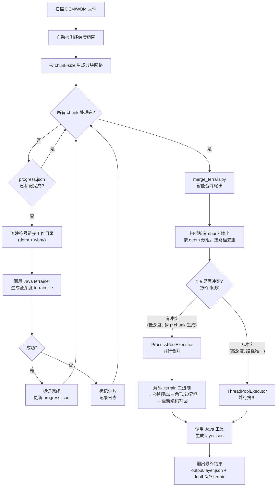

# terrain_chunker + merge_terrain

分块处理大量 GeoTIFF 地形数据，逐块调用 mago-3d-terrainer，避免 OOM。

整个流程分为两个脚本：
1. **terrain_chunker.py** — 分块生成 terrain tile
2. **merge_terrain.py** — 合并所有分块输出为最终结果

## 原理

将经纬度范围按 N° × N° 切分成多个子区域，每块只通过符号链接引用对应的 DEM/WBM 文件，独立调用 Java 工具处理。所有分块完成后，用 `merge_terrain.py` 合并输出。

合并策略：

- **无冲突 tile**（高深度，路径唯一）：直接拷贝
- **冲突 tile**（低深度，多个分块生成相同路径）：解析 quantized-mesh 二进制格式，合并顶点和三角形数据，重新编码写回

## 生成流程



### 流程说明

#### 第一步：terrain_chunker.py — 分块生成

1. 扫描 `--dem-dir` 和 `--wbm-dir`，用正则从文件名提取 (lat, lon) 坐标
2. 自动检测覆盖范围（或用 `--lat`/`--lon` 指定）
3. 按 `--chunk-size`° 将范围切分成 N×N 的网格，跳过空块
4. 逐块创建符号链接目录，调用 Java terrainer **生成全深度 tile**
5. 记录进度到 `progress.json`，支持 Ctrl+C 优雅中断和断点续跑

#### 第二步：merge_terrain.py — 智能合并

- 按 depth 层级顺序处理，每层独立进度文件
- **无冲突**（路径唯一，只有 1 个来源）→ `ThreadPoolExecutor` 并行拷贝
- **有冲突**（同一路径有多个 chunk 生成的文件）→ `ProcessPoolExecutor` 并行解码/合并/编码
- 每个 depth 层级的开始/结束记录到 `terrain-merge.log`
- 最后调用 Java 工具生成 `layer.json`

## 环境准备

```bash
cd scripts
uv sync        # 创建虚拟环境
```

## 参数说明

| 参数 | 必需 | 默认值 | 说明 |
| --- | --- | --- | --- |
| `--dem-dir` | 是 | - | DEM 文件目录 |
| `--wbm-dir` | 是 | - | WBM 文件目录 |
| `--output-dir` | 是 | - | 最终合并输出目录 |
| `--jar` | 是 | - | Java JAR 文件路径 |
| `--lat` | 否 | 自动检测 | 纬度范围，格式 `start-end`，如 `3-54` |
| `--lon` | 否 | 自动检测 | 经度范围，格式 `start-end`，如 `73-136` |
| `--chunk-size` | 否 | `10` | 每块度数（1° = 每个 Copernicus 文件单独跑） |
| `--chunk` | 否 | 全部 | 指定分块索引，支持 `3` 或 `3-7` |
| `--heap` | 否 | `16g` | JVM 堆内存大小 |
| `--work-dir` | 否 | `./chunk_work` | 临时工作目录（存放符号链接、分块输出、进度文件） |
| `--java-opts` | 否 | 无 | 传递给 Java 工具的额外参数，如 `-max 14 -th 4` |
| `--dry-run` | 否 | - | 预览分块计划，不实际执行 |
| `--clean` | 否 | - | 清除工作目录，从头开始 |

## 使用示例

### 完整流程（推荐）

分两步执行：先生成分块，再合并。

```bash
# 第一步：分块生成 terrain tile
uv run python scripts/terrain_chunker.py \
    --dem-dir input/dem \
    --wbm-dir input/wbm \
    --output-dir output/ \
    --jar mago-terrainer/dist/mago-3d-terrainer-1.12.0-release.jar

# 第二步：合并所有分块输出
uv run python scripts/merge_terrain.py \
    --chunk-work-dir ./chunk_work \
    --output-dir output/ \
    --jar mago-terrainer/dist/mago-3d-terrainer-1.12.0-release.jar
```

### 预览分块计划

```bash
uv run python scripts/terrain_chunker.py \
    --dem-dir input/dem \
    --wbm-dir input/wbm \
    --output-dir output/ \
    --jar mago-terrainer/dist/mago-3d-terrainer-1.12.0-release.jar \
    --dry-run
```

### 处理指定经纬度范围（单块）

```bash
uv run python scripts/terrain_chunker.py \
    --dem-dir input/dem \
    --wbm-dir input/wbm \
    --output-dir output/ \
    --jar mago-terrainer/dist/mago-3d-terrainer-1.12.0-release.jar \
    --lat 3-4 --lon 73-74
```

### 只跑特定分块

```bash
# 跑第 3 块
uv run python scripts/terrain_chunker.py ... --chunk 3

# 跑第 3 到 7 块
uv run python scripts/terrain_chunker.py ... --chunk 3-7
```

### 自定义 JVM 堆内存和分块粒度

```bash
# 内存较小：用 5° 分块（每块约 25 个文件）+ 8G 堆
uv run python scripts/terrain_chunker.py \
    --dem-dir input/dem \
    --wbm-dir input/wbm \
    --output-dir output/ \
    --jar mago-terrainer/dist/mago-3d-terrainer-1.12.0-release.jar \
    --chunk-size 5 --heap 8g
```

### 传递额外参数给 Java 工具

```bash
uv run python scripts/terrain_chunker.py \
    --dem-dir input/dem \
    --wbm-dir input/wbm \
    --output-dir output/ \
    --jar mago-terrainer/dist/mago-3d-terrainer-1.12.0-release.jar \
    --java-opts "-max 14 -th 4"
```

## 断点续跑

两个脚本都支持断点续跑，中断后重新运行相同命令即可继续。

### terrain_chunker.py

在 `{work-dir}/{chunk_label}/progress.json` 中记录每个分块的进度。

```bash
# 第一次运行（中途中断）
uv run python scripts/terrain_chunker.py ...

# 重新运行，自动跳过已完成的分块
uv run python scripts/terrain_chunker.py ...
```

如需从头开始：

```bash
uv run python scripts/terrain_chunker.py ... --clean
```

### merge_terrain.py

在 `{output-dir}/.merge_progress/depth_{N}.json` 中记录每个 depth 层级的进度。中断后重跑会跳过已完成的层级，未完成的层级只处理剩余的 tile。

```bash
# 第一次运行（中途中断）
uv run python scripts/merge_terrain.py ...

# 重新运行，自动跳过已完成的层级
uv run python scripts/merge_terrain.py ...
```

如需从头开始：

```bash
uv run python scripts/merge_terrain.py ... --clean
```

---

## merge_terrain.py

独立合并脚本，将所有分块输出合并为最终 terrain tile 数据集。

### 参数说明

| 参数 | 必需 | 默认值 | 说明 |
| --- | --- | --- | --- |
| `--chunk-work-dir` | 否 | `./chunk_work` | 分块工作目录 |
| `--output-dir` | 是 | - | 最终合并输出目录 |
| `--jar` | 是 | - | Java JAR 文件路径（用于生成 layer.json） |
| `--heap` | 否 | `16g` | JVM 堆内存大小 |
| `--java-opts` | 否 | 无 | 传递给 Java 工具的额外参数 |
| `--workers` | 否 | CPU 核数 | 并行 worker 数 |
| `--clean` | 否 | - | 清除输出目录，从头开始 |
| `--skip-layer-json` | 否 | - | 跳过 layer.json 生成 |

### 合并特性

- **真正并行**：多源 tile 合并使用 `ProcessPoolExecutor`（绕过 GIL），单源拷贝使用 `ThreadPoolExecutor`
- **断点续跑**：每个 depth 层级独立进度文件，中断后自动恢复
- **完整日志**：所有操作记录到 `{output-dir}/terrain-merge.log`，包括每个 depth 的开始/结束、tile 统计、耗时
- **原子写入**：合并结果先写临时文件再原子替换，避免写入中断导致文件损坏

### 合并示例

```bash
# 基本用法
uv run python scripts/merge_terrain.py \
    --chunk-work-dir ./chunk_work \
    --output-dir output/ \
    --jar mago-terrainer/dist/mago-3d-terrainer-1.12.0-release.jar

# 自定义并行数
uv run python scripts/merge_terrain.py \
    --chunk-work-dir ./chunk_work \
    --output-dir output/ \
    --jar mago-terrainer/dist/mago-3d-terrainer-1.12.0-release.jar \
    --workers 8

# 跳过 layer.json（手动生成或已有）
uv run python scripts/merge_terrain.py \
    --chunk-work-dir ./chunk_work \
    --output-dir output/ \
    --jar mago-terrainer/dist/mago-3d-terrainer-1.12.0-release.jar \
    --skip-layer-json
```

### 日志示例

```
14:00:01 ============================================================
14:00:01 merge_terrain.py 启动
14:00:01 分块目录: chunk_work
14:00:01 输出目录: output
14:00:01 并行 workers: 8
14:00:02 共 14 个 depth 层级，52847 个 tile，312 个冲突合并
14:00:02 [depth 0] 开始处理 — 共 1 个 tile (拷贝 0, 合并 1, 已完成 0)
14:00:02 [depth 0] 完成 — 拷贝 0, 合并 1, 失败 0 (0.3s)
14:00:02 [depth 1] 开始处理 — 共 4 个 tile (拷贝 0, 合并 4, 已完成 0)
14:00:02 [depth 1] 完成 — 拷贝 0, 合并 4, 失败 0 (0.1s)
...
14:05:30 [depth 13] 完成 — 拷贝 42100, 合并 200, 失败 0 (180.2s)
14:05:30 ============================================================
14:05:30 合并完成: 拷贝 52100, 合并 312, 失败 0, 跳过 0 (320.1s)
14:05:31 开始生成 layer.json...
14:05:33 layer.json 生成完成
14:05:33 全部完成! 共 52412 个 terrain 文件
```

## 输出结构

```text
chunk_work/                        ← --work-dir (terrain_chunker.py)
  chunk_00_lat29-32_lon118-122/
    progress.json                  ← 该块进度文件
    dem/                           ← DEM 符号链接
    wbm/                           ← WBM 符号链接
    output/                        ← 该块的 Java 输出
    output.log                     ← 该块的运行日志
  chunk_01_.../
    ...

output/                            ← --output-dir (merge_terrain.py)
  .merge_progress/                 ← 合并进度文件
    depth_0.json
    depth_1.json
    ...
  terrain-merge.log                ← 合并日志
  layer.json                       ← 合并后重新生成
  0/0/0.terrain
  1/...
  ...
```

## 分块大小选择

| chunk-size | 每块文件数 | 适用场景 |
| --- | --- | --- |
| 1 | 1 | 内存极小（4G 以下） |
| 5 | ~25 | 内存有限（8G） |
| 10 | ~100 | 推荐（16G） |
| 20 | ~400 | 内存充足（32G+） |

## 支持的文件格式

- DEM: `Copernicus_DSM_10_N{lat}_00_E{lon}_00_DEM.tif` 或 `Copernicus_DSM_COG_10_N{lat}_00_E{lon}_00_DEM.tif`
- WBM: `Copernicus_DSM_COG_10_N{lat}_00_E{lon}_00_WBM.tif`
